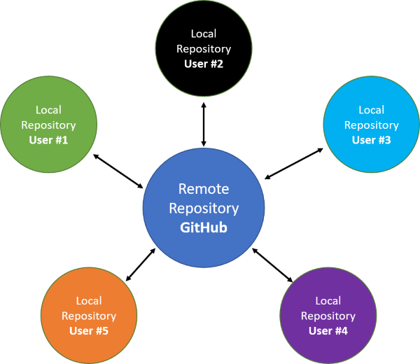
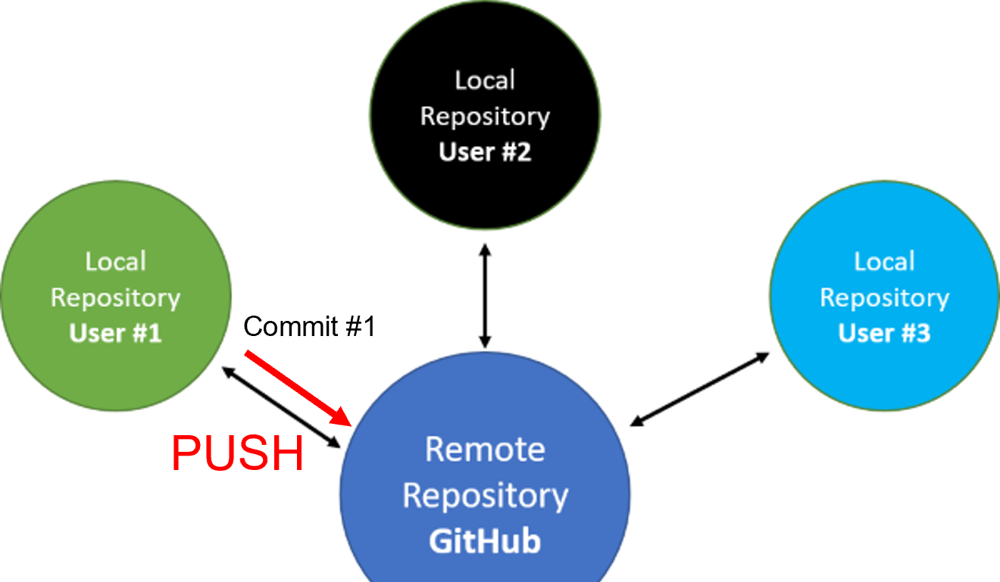
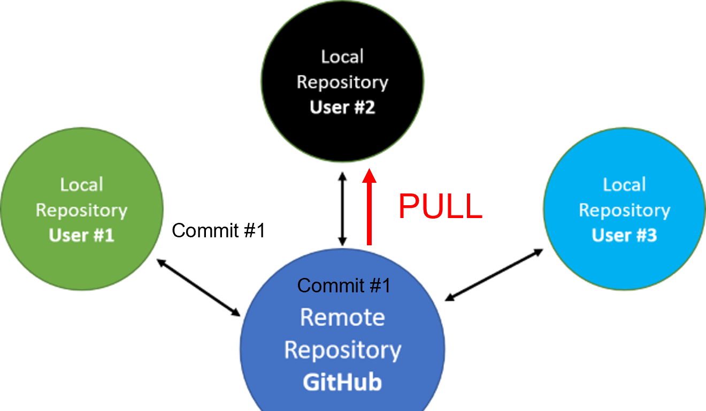

```{r setup, include = FALSE}
options(htmltools.dir.version = FALSE)
knitr::opts_chunk$set(warning = FALSE, message = FALSE)
```

# Goal of Tutorial

<br>

- Provide a basic overview of Git and GitHub

- Information on how to use these tools with work projects

- Focus is from a beginner perspective

- Interactive - please feel free to ask questions or provide feedback during the workshop

---

# Tutorial Outline

--

What is Git and GitHub and why should I use them?<br>
Short Tour of GitHub<br>
Common Terminology

--

Configuring Git<br>
**Activity 1: Setup Git Terminal and Configuration**

--

Creating and Cloning Repositories<br>
**Activity 2: Create and Clone a Repository**

--

Committing, Pushing, and Pulling<br>
**Activity 3: Commit and Push from Local Repository**<br>
**Activity 4: Commit in GitHub and Pull into Local Repository**

--

Collaborating with Others: Forking vs. Cloning, Adding Collaborators<br>
**Activity 5: Add a Collaborator**<br>
**Activity 6: Collaborate on Repository**

---

# Tutorial Outline - continued

Collaborating with Others: Avoiding Merge Conflicts<br>
**Activity 7: Resolving Merge Conflicts (optional, if time allows)**

--

Open Questions

--

Intermediate-level topics (optional, if time allows)

---

# Git vs. GitHub

<br>

**Git** is a version control system originally used by software developers to work together on large projects

**GitHub** is a web or cloud-hosting service for Git-based projects

---

# Why should I use it?

<br>

-	Version control and backup

-	**Collaboration**

-	Sharing and developing R packages

---
class: inverse, middle

# GitHub Tour

- Home Page
- Commit History
- Repository and Account Settings

---

# Common Terms

--

- Repository: a set of files managed by Git

--

- Commit: a "snapshot" of all of the files in the repository at a particular time

--

- Local repository: A project saved on your computer

--

- Remote repository: Version of the project that is hosted somewhere other than your computer. Most common is GitHub.

--

- Push: Sends changes made on a local repository to the remote repository

--

- Fetch: Retrieves changes from a remote repository, but does **NOT** change the state of the local repository in any way

--

- Pull: Fetches changes from a remote repository and merges them into the local repository

--

- Branch: Parallel tracks that allow multiple users to work on the same project without overwriting work

--

- Organization: shared accounts where businesses and open-source projects can collaborate across many projects at once

---

# Local vs. Remote repositories

```{r print local vs remote image, echo = FALSE, fig.align = 'center', out.width = '55%'}

```

---

# Configuring Git

<br>

Using Git Bash or command line:<br>

`git config --global user.name 'Your Name'`<br>
`git config --global user.email 'yourname@domain.com'`<br>
Check configuration with `git config --global --list`

<br>

Using the [`usethis` package](https://usethis.r-lib.org/) in R:

```{r echo = TRUE, eval = FALSE}
usethis::use_git_config(user.name = "Your Name", user.email = "yourname@domain.com")
```

---
class: inverse, middle

# Activity 1

### Setup Git Terminal and Configuration

- Set up RStudio Terminal to work with Git
- Use Git command line to:
  - Check configuration
  - Set up user name and email
  - Re-check configuration
- Demonstrate Git Bash

---

# Creating and Cloning Repositories

1) Create a new repository on GitHub

2) Clone the new repository to your local computer using one of the following methods:
  - RStudio: *File > New Project > Version Control > Git*
  - Git Bash or command line: `git clone <repo URL>`
  - Using the [`usethis` package](https://usethis.r-lib.org/) in R:

```{r echo = TRUE, eval = FALSE}
usethis::create_from_github("repo URL")
```

3) Check if you have a local repository stored on your computer

<br>

**TIP:** Use a consistent directory on your computer for your local Git repositories 

---
class: inverse, middle

# Activity 2

### Create and Clone a Repository

- Create a new repository on GitHub
- Clone the new repository to your local computer using RStudio
- Check if you have a local repository stored on your computer

---

# Committing, Pushing, and Pulling

### Committing Changes

1) Make some changes to the repository

2) Stage the changes using one of the following methods:
  - RStudio: check the box next to the file(s) you would like to commit in the Git pane
  - Git Bash or command line: `git add <directory or file>`
  
3) Commit staged changes using one of the following methods:
  - RStudio: use the commit window accessed from the Git pane
  - Git Bash or command line: `git commit -m "<message>"`

<br>

**TIP:** Make each commit for one specific change to the repository

---

# Committing, Pushing, and Pulling

### Pushing Commits

- RStudio: use the button in the Git pane

- Git Bash or command line: `git push <remote> <branch>`

**TIP:** Push one or more commits to the remote repository once you have a finished product or fix

```{r print git push image, echo = FALSE, fig.align = 'center', out.width = '50%'}

```

---
class: inverse, middle

# Activity 3

### Commit and Push from Local Repository

- Make a change to the README file in the local repository
- Stage and commit this change using the Git pane in RStudio
- Push the commit to the remote repository on GitHub
- Check if the local change is now on the GitHub remote
- Repeat the steps above to check if your GitHub credentials were cached properly (You should **NOT** be asked for your username and password a second time)

---

# Committing, Pushing, and Pulling

### Pulling Commits

- RStudio: use the button in the Git pane

- Git Bash or command line: `git pull <remote>`

```{r print git pull image, echo = FALSE, fig.align = 'center', out.width = '50%'}

```

---
class: inverse, middle

# Activity 4

### Commit in GitHub and Pull into Local Repository

- Make a change to the README file in the remote repository on GitHub
- Commit this change in GitHub
- Pull change into the local repository using the Git pane in RStudio
- Confirm that the change is now in the local repository

---

# Collaborating with Others

### Cloning vs. Forking Repositories

--

#### Clone:

- A copy of a remote repository stored as a local repository on your computer
- Able to push, fetch, and pull changes directly with the remote repository
- Usually the configuration with your own repositories or with other repositories that you are a collaborator on

--

<br>

#### Fork:

- A special configuration which is usually a copy of someone else's repository
- Able to fetch and pull changes and make edits on your forked copy
- **NOT** able to directly push edits to the original repository, only to the forked repository
- Usually the configuration when you create pull requests or when you are not a collaborator on a public repository

---

# Collaborating with Others

### Adding Collaborators

Allows for others to clone your repository and directly push, fetch, and pull changes

1) Open up "Settings" in your remote repository on GitHub

2) Select "Manage access" and then "Invite a collaborator"

3) Enter the username of your collaborator

4) A confirmation email will be sent to your collaborator. Wait for them to confirm.

---
class: inverse, middle

# Activity 5

### Add a Collaborator

- Invite your activity partner as a collaborator to your GitHub repository
- Collaborator confirms invite

---
class: inverse, middle

# Activity 6

### Collaborate on Repository

- With your collaborator:
  - Clone your collaborator's repository to your computer
  - Take turns committing, pushing, and pulling changes on each repository

---

# Collaborating with Others

### Avoiding Merge Conflicts

A merge conflict occurs when 2 people change the same lines in the same file without first pulling in the changes that the other has made. This is always a possibility when 2 or more people are actively working on a repository.

<br>

How to avoid:

- Communicate often with your collaborators
- Pull each time you open up the project in RStudio
- Use the workflow: *Pull > Edit > Pull > Commit > Push*
- Pull before every commit, and commit often

---
class: inverse, middle

# Activity 7

### Resolving Merge Conflicts 

(optional, if time allows)

- Create a merge conflict
- Resolve conflict

---

# Open Questions???

---

# Intermediate-level topics 

(optional, if time allows)

- gitignore file
- Commit history and diff
- Undoing changes
- Branches
- Merging branches
- Pull requests

