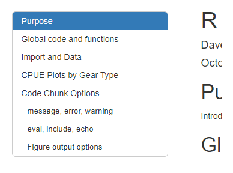
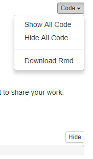
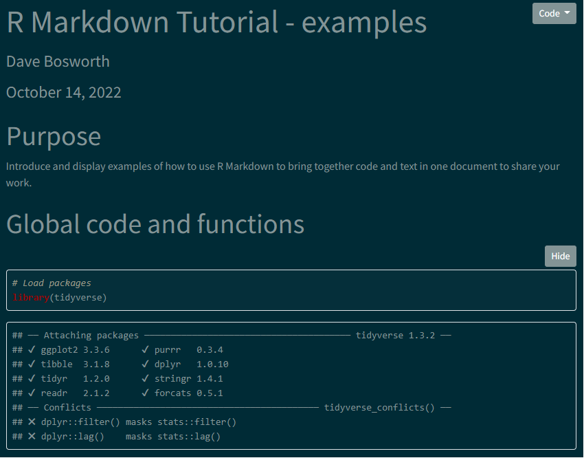
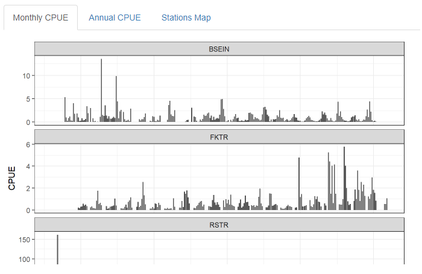

```{r setup, include = FALSE}
options(htmltools.dir.version = FALSE)
knitr::opts_chunk$set(warning = FALSE, message = FALSE)
```

# Introduction

- A little about me

--


- About you
  - Most of you have used R before
  - Some of you have used R Markdown before 
  - All of you want to learn about using R Markdown to help with communicating your scientific work

---

# Tutorial Outline

--

R Markdown basics: What is it, and why should I use it?  
**Activity 1:** Open test file, load data, and run code  

--

Basic syntax and structure  
**Activity 2:** Create new document, practice using some syntax options, knit file to html 

--

Code chunks and inline code  
**Activity 3:** Inserting and running code  

--

Code chunk options  
**Activity 4:** Modify code chunk options  

--

Basic Pandoc-header options  
**Activity 5:** Modify YAML options  

---

# Tutorial Outline - continued

Adding and formatting tables  
**Activity 6:** Tables  

--

Adding interactive elements: plotly, leaflet, datatable (DT)  
**Activity 7:** Interactive elements  

--

Adding tabs  
**Activity 8:** Tabs  

--

Open Questions  

--

GitHub Introduction

---

# What is R Markdown?

- R-specific file type (.Rmd) that provides a platform for science communication

--

- Used to save and execute code just like an R script, but in a notebook format

--

- Allows for code and text narrative in the same document

---

# How is R Markdown different than an R script?

- Results from code and narrative text can be stitched ("knitted") together in the output

--


- Allows for many output options including: 
  - HTML, PDF, and Microsoft Word 
  - presentation slides
  - books and scientific articles
  - dashboards and shiny applications
  - websites

---

# Why use R Markdown?

- Organize your code into "chunks" that can be run individually (notebook format)

--

- Save code and narrative text together in one document

--

- Share code and results with others - reproducible, transparent, clearly communicated

--

- Can be used to create automated reports

---
class: inverse, middle

# Activity 1

### Basic Setup

Open test.Rmd file, load data, and run code

---

# R Markdown Document Structure

## Metadata (YAML header)

Optional section for rendering options (pandoc) as key: value pairs

```{r example yaml header, eval = FALSE}
---
title: "Testing R Markdown"
author: "Dave Bosworth"
date: '`r format(Sys.Date(), "%B %d, %Y")`'
output: html_document
---
```

---

# R Markdown Document Structure

## Narrative Text

Narration formatted with markdown -  

- Plain text
- Headers
- Text formatting (bold, italic)
- Links
- Images
- Numbered and unordered lists
- Code
- Equations

[R Markdown Reference Guide](https://www.rstudio.com/wp-content/uploads/2015/03/rmarkdown-reference.pdf)

---

# R Markdown Document Structure

## Code chunks

- Sections of embedded R code within the document
- Code is run when R Markdown file is "knitted" with results displayed in the output document 

```{r code chunk example, fig.height = 5}
plot(pressure)
```

---
class: inverse, middle

# Activity 2

### Basic Usage

- Create new document
- Practice using some syntax options
- "Knit" file to html

---

# Code within R Markdown

### Code chunks

```{r code chunk example 2}
summary(cars)
```

--

***

### Inline code

```{r inline code example}
# Today's date is `r Sys.Date()`
```

Today's date is `r Sys.Date()`

---

# File paths and working directories in R Markdown

This can be a source of confusion, so its worthwhile taking a moment to cover this:

- The default working directory when an .Rmd file is knitted is the .Rmd document directory

- The default working directory of an R project is the root directory of the R project

- So it's possible to have different working directories when you are running code from code blocks in an .Rmd file versus when you knit the .Rmd file

- A useful R package to help with working directories and file paths is the [`here` R package](https://here.r-lib.org/)

- The `here::here()` function points to the root directory of an R project regardless of what the current working directory is

---
class: inverse, middle

# Activity 3

### Inserting and running code

---

# Code Chunk Options

### message, warning

`message = TRUE`

```{r true message output example, message = TRUE}
library(tidyverse)
```

--

***

`message = FALSE`

```{r false message output example}
library(tidyverse)
```

---

# Code Chunk Options

### eval, include, echo

- `eval` - default is `eval = TRUE`
  - if `eval = FALSE`, the code will not run in the code block when "knitted", but the code appears in the output file
  
--


- `include` - default is `include = TRUE`
  - if `include = FALSE`, the code and results won't appear in output file, but the code is still executed and results can be used by other code chunks

--


- `echo` - default is `echo = TRUE`
  - if `echo = FALSE`, the code won't appear in the output file, but the results are still displayed

---

# Code Chunk Options

### Figure output options

- `fig.height`, `fig.width` - the height and width in inches for figures created by the code chunk

--

- `fig.align` - allows for custom alignment of figures in the output file. Can be "left", "right", or "center"

--

- `fig.cap` - figure caption

- `fig.alt` - alt text for a figure

---
class: inverse, middle

# Activity 4

### Modify code chunk options

---

# Basic Pandoc-header options

Standard options: title, author, date, output type

```{r example yaml header 2, eval = FALSE}
---
title: "Testing R Markdown"
author: "Dave Bosworth"
date: "October 17, 2022"
output: html_document
---
```

--

Make the date dynamic by using R code in the YAML header:

```{r example yaml header dyn date, eval = FALSE}
---
title: "Testing R Markdown"
author: "Dave Bosworth"
date: "`r Sys.Date()`"
output: html_document
---
```

---

# Basic Pandoc-header options

## HTML Output Options - Table of Contents

.pull-left[
#### Header

***

```{r yaml add toc, eval = FALSE}
---
output: 
  html_document: 
    toc: true
    toc_float:
      collapsed: false
---
```
]

.pull-right[
#### Output

***

```{r print yaml toc image, echo = FALSE, out.width = '80%'}

```
]

---

# Basic Pandoc-header options

## HTML Output Options - Code Folding and Download

.pull-left[
#### Header

***

```{r yaml code fold and download, eval = FALSE}
---
output: 
  html_document: 
    code_folding: show
    code_download: true
---
```
]

.pull-right[
#### Output

***

```{r print yaml code fold and download image, echo = FALSE, out.width = '40%'}

```
]

---

# Basic Pandoc-header options

## HTML Output Options - Bootswatch Themes

.pull-left[
#### Header

***

```{r yaml themes, eval = FALSE}
---
output: 
  html_document: 
    theme:
      bootswatch: solar
---
```
]

.pull-right[
#### Output

***

```{r print yaml themes image, echo = FALSE, out.width = '90%'}

```
]

Use `bslib::bootswatch_themes()` to list available themes

---
class: inverse, middle

# Activity 5

### Modify YAML options

---

# Adding and formatting tables

### Basic printing

```{r basic table printing}
df <- head(mtcars)
df
```

---

# Adding and formatting tables

### Kable

```{r table with kable}
library(knitr)
kable(df)
```

---

# Adding and formatting tables

### Kable styling

```{r kable with styling}
library(kableExtra)
kable(df, format = "html") %>% kable_styling(font_size = 10)
```

---
class: inverse, middle

# Activity 6

### Tables

---

# Adding interactive elements

## datatable (DT)

```{r create datatable}
library(DT)
datatable(mtcars, options = list(pageLength = 5))
```

---

# Adding interactive elements

## plotly

.pull-left[
```{r using plotly, results = 'hide'}
library(plotly)
plt <- 
  ggplot(
    data = mtcars, 
    aes(x = wt, y= mpg, color = cyl)
  ) +
  geom_point()

ggplotly(plt, width = 500, height = 400)
```
]

.pull-right[
```{r ref.label = 'using plotly', echo = FALSE}

```
]

---

# Adding interactive elements

## leaflet

.pull-left[
```{r using leaflet, results = 'hide'}
library(leaflet)
leaflet(width = 400, height = 400) %>%
  addTiles() %>%
  addMarkers(
    lng = 174.768, 
    lat = -36.852, 
    popup = "The birthplace of R"
  )
```
]

.pull-right[
```{r ref.label = 'using leaflet', echo = FALSE}

```
]

---
class: inverse, middle

# Activity 7

### Interactive elements

---

# Adding tabs

```{r print tabset image, echo = FALSE, out.width = '70%'}

```

---
class: inverse, middle

# Activity 8

### Tabs

---

# Open Questions???

---

# GitHub Introduction

- Participants poll

--

- Homework!

--

- Tutorial will be held through Teams on **November 18, 2022 from 1:30-3:00**
